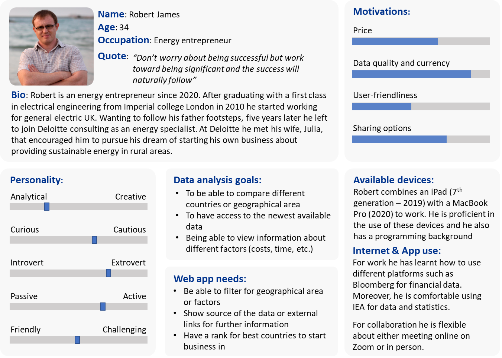
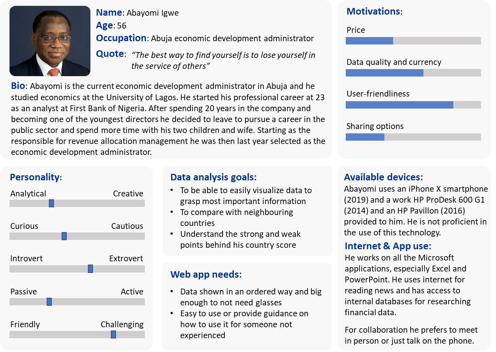
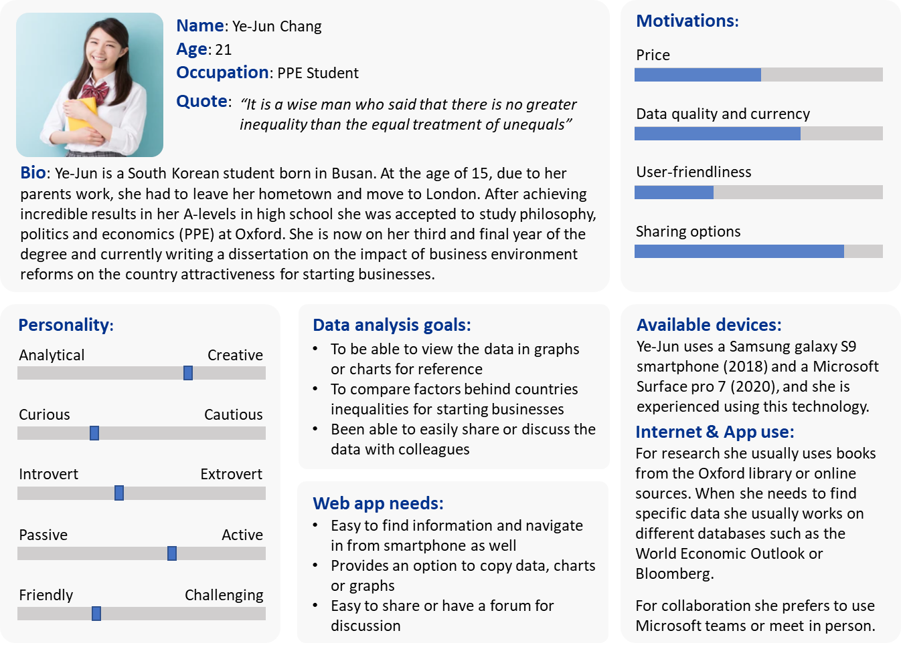
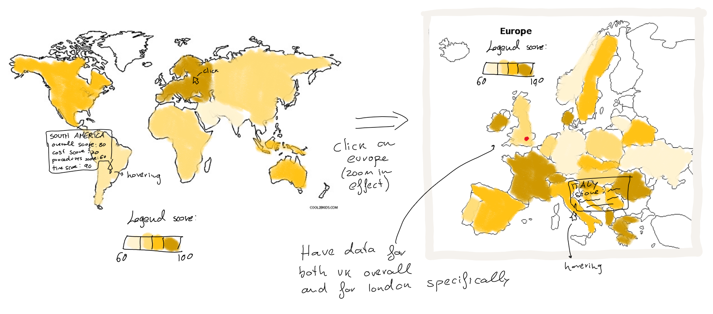
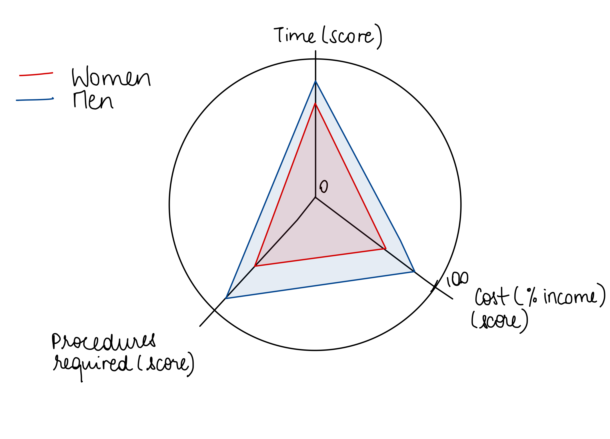

# Coursework 1 Notebook

## Target Audience

The soon-to-be developed web-based app, will have the characteristics of an interactive dashboard and will be accessible
to everyone. However, during the kick-off of the project, the IFP team has identified three different possible groups of
target audience. Considering the information that will be provided on the app, the first group of target audience can be
identified in the potential entrepreneurs wanting to start a business. However, as mentioned before, the team also hopes
that the app will be used by local administrative authorities to help them realize the possible areas of improvement to
increase entrepreneurial attractiveness. Finally, as the app will be accessible to anyone, the team expects it to become
a benchmark for students or professionals interested in the research field. Considering the three groups of target
audience, three different personas have been developed.

#### Persona 1: Potential Entrepreneurs

#### Persona 2: Administrative Authorities

#### Persona 3: Researchers

## Questions to be answered using the dataset

Considering the problem statement and the target audience previously defined, the following questions should be answered
using the dataset. The main question to be answered would be:

- Which country represents the best option to start a business in terms of costs, time and procedures required?

Along with the main question, there are multiple subquestions that are more specific:

- What is the relation between income group and starting a business score?
- How have the costs, time and procedures required for starting a business changed over time with respect to gender and
  geographical region?
- Which is the geographical region that offers the best options for starting a business?
- Which countries share similar scores for different starting business indicators?
- How many countries have had more than 50% reduction in one or more indicators' values?
- What differences can be found between indicators for countries in specific geographical regions?

While the main question is of interest for every group of target audience, the subquestions are more specific to some
groups. For example, the last one could be of interest for the target audience groups represented by the personas 2 and

3. On the other hand, the third question could be of interest for an entrepreneur (persona 1).

## Ideas for charts

### Andrea

Considering the data and the questions to be answered me and Cate came up with a few ideas.

We need to invert indicators and years in the dataframe, put a year column and creat specific columns for each
indicator.

Focusing on the main question to be answered what could be useful is to have a choropleth map
[https://datavizcatalogue.com/methods/choropleth.html](https://datavizcatalogue.com/methods/choropleth.html). However
instead of being a normal map we can make it more interactive by implementing a zoom-in approach. What I mean is to
create something that goes from general to specific gradually. More specifically it would be a choropleth map of the
whole world, however considering that there are 191 countries it could be messy and misleading to show them all on the
same map. This could cause something like overcrowded data resulting in hiding some and counterproductive (having some
countries much bigger than others in terms of area, people would hover and focus on those rather than looking at smaller
countries as well for example). Therefore, since these countries are split in 7 geographical regions, it could be useful
to show a map of the world divided only for those 7 regions. The data that will be displayed or the legend will be based
on the overall starting a business score. This will be calculated for each region by averaging the one of the singular
countries. However, something more could be implemented such as the hovering function. This mean that when hovering over
a region
(example: europe) more data appear such as the score for cost, time and num of procedures (these are the indicator that
make up for the overall score). Finally, when clicking on a specific region what would happen is that it would zoom in
and at this point the singular countries for that region would be shown with their own values. Moreover, some countries
have values for also different cities that can be shown by putting a circle or dot in the geographical position. Look at
the very approximate sketch shown below.

Considering other questions the following charts could also be implemented:

- Radar
  chart [https://datavizcatalogue.com/methods/radar_chart.html](https://datavizcatalogue.com/methods/radar_chart.html)
  used to show for each geographical region or country the different score values for the indicators. This kind of shows
  the 'performance' of that region/country in specific
- Bar chart [https://datavizcatalogue.com/methods/bar_chart.html](https://datavizcatalogue.com/methods/bar_chart.html)
  this can be used to show for a singular indicator all the countries or region values. Imagine for example that it
  could be used to show in a sort of way the ranking so from the highest score or value to lowest. Again this can be
  implemented with a generic to specific approach (region -> countries of selected region) making it more interactive
- Classic line chart to show progression over time of a certain indicator maybe, reference to
  [Upper_middle_income.png](../Previous meterial/Upper_middle_income.png),
  [Score_regional_analysis.png](../Previous meterial/Score_regional_analysis.png),
  [Lower_middle_income.png](../Previous meterial/Lower_middle_income.png),
  [low_income.png](../Previous meterial/low_income.png),
  [High_income.png](../Previous meterial/High_income.png)

Finally, a bubble
chart. [https://datavizcatalogue.com/methods/bubble_chart.html](https://datavizcatalogue.com/methods/bubble_chart.html).
This can be used to show the relation between 3 variable: how cost depends on value of num of procedure and time. If you
look at the TED talk video he uses it in the way from generic to specific. So plotting bubbles for geographical regions
and if you click on them, they open up in the different country bubbles. Moreover, we could plot 1 bubble for the value
for male and one for the value for female generating a 4/5 variable chart (time vs num of procedure vs cost for male vs
female in diff countries)

### Nikos

After examining the target groups I would like to add the following ideas.

To answer the main question , I think that we could create a combined indicator( maybe average score ) for males and
females separately. This will be used to rank the countries in a clear order as to which is the best to start a business
at based on your gender. Using a bar
chart [https://datavizcatalogue.com/methods/bar_chart.html](https://datavizcatalogue.com/methods/bar_chart.html) then we
can display the top 10 countries for each gender. It can serve as an alternative to the map that Andrea and Cate
suggested, providing a more easy-to-read, condense, form of the information. For example someone may only be interested
in finding the top countries/areas rather than exploring the different values manually from the map.

Adding to the bubble graph idea, we can use the bubbles to also demonstrate how the combine score is calculated. E.G.
you click on the Country bubble indicating the combined score and then the individual scores for each category of the
country/region show up.

A line
graph [https://datavizcatalogue.com/methods/line_graph.html](https://datavizcatalogue.com/methods/line_graph.html) can
be used to demonstrate the trend over the years for different regions as already mentioned. I don't believe there is a
better way of demonstrating that without using video or gif. Plotting several regions/countries on the same graph would
allow for an easy visual comparison for the visitor

Since we are interested in the progress different countries make over time, again the idea of plotting the "top 10"
countries with the highest improvement indicators as a bar chart, may be simple, but I feel like it's a great way of
passing on the information is a fast-manner.

## Choropleth Map (Andrea + Nikos)

Looking at the documentation online I found something that can be helpful.
([https://plotly.github.io/plotly.py-docs/generated/plotly.express.choropleth.html](https://plotly.github.io/plotly.py-docs/generated/plotly.express.choropleth.html))

This is what the input of the function should look like:

import plotly.express as px

px.choropleth(data_frame=None, lat=None, lon=None, locations=None, locationmode=None, geojson=None, featureidkey=None,
color=None, facet_row=None, facet_col=None, facet_col_wrap=0, facet_row_spacing=None, facet_col_spacing=None,
hover_name=None, hover_data=None, custom_data=None, animation_frame=None, animation_group=None, category_orders=None,
labels=None, color_discrete_sequence=None, color_discrete_map=None, color_continuous_scale=None, range_color=None,
color_continuous_midpoint=None, projection=None, scope=None, center=None, fitbounds=None, basemap_visible=None,
title=None, template=None, width=None, height=None)

Now the parameters that we have to use are the following:

- data_frame (dataframe to use for data)
- locations (column in dataframe with ISO codes to match featureidkey)
- locationmode or geojson (depending on whether we use external or built-in map geometry)
- featureidkey (if using geojson is the key that uses to match values from dataframe to geometry map)
- color (column in data frame to assign color marks - basically variable that we want to show. Considering how the data
  frame is built we can use and filter through overall score (starting a business - score), and the three single
  indicators:
  time, procedure required and cost scores) - The interactivity can be done by using app callback

example of interactivity with different colormaps:

[Link
](https://plotly.com/python/choropleth-maps/#:~:text=Bergeron-,Choropleth%20maps%20in%20Dash,to%20effortlessly%20style%20%26%20deploy%20apps%20like%20this%20with%20Dash%20Enterprise.,-Discrete%20Colors)

app.layout = html.Div([
html.P("Candidate:"), dcc.RadioItems(
id='candidate', options=[{'value': x, 'label': x} for x in candidates], value=candidates[0], labelStyle={'display': '
inline-block'}
), dcc.Graph(id="choropleth"),
])

@app.callback(
Output("choropleth", "figure"),
[Input("candidate", "value")])  # Here the input is captured

def display_choropleth(candidate):
fig = px.choropleth(
df, geojson=geojson, color=candidate, # here it uses the input "candidate" to update map based on chosen value
locations="district", featureidkey="properties.district", projection="mercator", range_color=[0, 6500])
fig.update_geos(fitbounds="locations", visible=False)
fig.update_layout(margin={"r":0,"t":0,"l":0,"b":0})

End of Example.

- hover_name
- hover_data (to show data when hovering over country)

- animation_frame: This could be really cool, we can produce something that shows progression in the years, look at this
  link for further
  explanation: [link](https://towardsdatascience.com/how-to-create-an-animated-choropleth-map-with-less-than-15-lines-of-code-2ff04921c60b#ced3)

Other interactive stuff we could
do: [link](https://towardsdatascience.com/highlighting-click-data-on-plotly-choropleth-map-377e721c5893)
I have been trying to search how to create different map layers controlled by the zoom level but cannot find anything
for python dash and plotly.

I would say major things to focus on are:

- style (3 drop menus one next to each other with different colour)
- Remove the x button from dropdown or use it properly
- Make map bigger
- colormap title/legend always set to 'Score' (done)
- look at plotly go styling objects and see if some can apply
- check adding top 10 bar chart/list on the side (concerns: overcrowded)

## Radar Chart

Another useful type of chart that can be used is the radar chart. They would enable the app user to compare the
inequalities in setting up a business based on gender. For each combination of country and year, selected through two
seperate dropdown menus, there would be a different chart displayed. The chart would be similar to the sketch shown
below:

Two different charts would appear on the page, so that the user could compare the scores for different combinations of
countries and years.

## Starting a Business Page Layout

### Intro

The aim of our app is to encourage entrepreneurs from all around the world to start up their business. We do that by
making data more accessible about the ease of setting up a business in a variety of countries and regions, based on
different indicators: the number of procedures required, the cost, the entrepreneur's gender and the time required to
set up a business. This available data is displayed in a variety of charts, and is aimed not only at entrepreneurs, but
also anyone interested in finding out more about the factors that might influence the start up of a business.

### Questions

Are you an entrepreneur? A local administrator? Or simply a student? Our range of charts will help you figure out the
impact certain regions or countries have on the ease of starting up a business.

Our choropleth map not only enables you to choose which scores to display (time, cost, number of procedures, overall),
but also to see the evolution of those scores in time by clicking on the play button on the year slider. Moreover, you
can focus on specific geographical regions or income groups listed in a dropdown menu, and identify which are the best
countries to start up a business by looking at the bar chart on the side.

If you want to analyse the relationship between the scores in time, cost and number of procedures required, the bubble
chart displays how the indicators influence each other. You can tick boxes to select which regions and gender you want
to look at. Below the bubble chart, you can find a table that is updated with the bubble chart, displaying the actual
data for each indicator, rather than the given scores.

If you are looking for a more detailed display of the gender inequalities in setting up a business, our radar chart will
enable you to compare the number of procedures and time required to set up a business, as well as its cost, according to
the entrepeneurs' gender. Clicking on 'Men' or 'Women' in the legend, will filter out the opposite option, enabling to
focus on a single gender.

### Sources

The data used to create our graphs, comes from:
...

### Footer

Organisation name

## About Us Page Layout

### Our organisation and members

We are a team of four engineering students, who are completing a project on displaying data in a non-misleading way. Our
aim was to create a range of charts, that would be able show which factors influence the ease of starting up a business.
(Team Picture)
