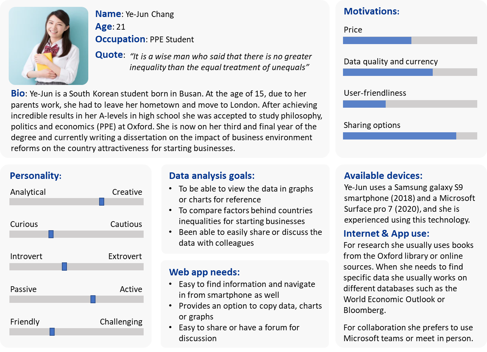

# Coursework 1

## Technical Information

### Repository URL

The following URL is a link to the repository for COMP0034 coursework 1 for group number 7:
[Repository Coursework 1 - Group 7](https://github.com/ucl-comp0035/comp0034-cw1-g-group-7-1.git)

### Set-up Instructions

Assuming that requirements will be installed from [requirements.txt](requirements.txt), the full list is provided in
that file.

All the requirements can be installed using the `pip install ...` method. The only additional requirement that is not in
the txt file is the *dash[testing]*. This can be installed by using the following code and running it in the terminal
within the venv: `pip install dash[testing]`.

The requirements added to the txt file that were not previously installed are also listed below:

- plotly
- pytest-cov
- selenium
- numpy

## Design of the app

Considering the data set available, the team decided to investigate and come up with some specifications about the
target audience and the possible questions to be answered. Before the start of the project the team decided that they
would have focused on different area in order to spam over a wider range of possible questions and target audience. For
this reason the goal or massive transformative purpose (MTP) of the team was to produce an interactive, user-friendly
app that would have enabled user from different backgrounds to efficiently obtain truthful information about starting a
business. The investigation process needed to identify and produce the target audience and questions was considered of
paramount importance due to its influence on the design of the app. In the next few sections a more detailed outline of
the targeted audience and the chosen questions to be answered is presented before outlining the design itself.

### Target Audience

The soon-to-be developed web-based app, will have the characteristics of an interactive dashboard and will be accessible
to everyone. However, during the kick-off of the project, the Inspire Future Potential (IFP) team has identified three
different possible groups of target audience. Considering the information that will be provided on the app, the first
group of target audience can be identified in the potential entrepreneurs wanting to start a business. However, as
mentioned before, the team also wanted to expand the target audience of the app. Thus, they hope that the app will be
used by local administrative authorities to help them realize the possible areas of improvement to increase
entrepreneurial attractiveness. Finally, as the app will be accessible to anyone, the team expects it to become a
benchmark for students or professionals interested in the research field. Considering the three groups of target
audience, three different personas have been developed.

#### Persona 1: Potential Entrepreneurs

#### Persona 2: Administrative Authorities

#### Persona 3: Researchers

### Questions to be answered with the app

Considering the target audience previously defined, and the overall goal set by the team, the following questions should
be answered when using the app. The main question to be answered would be:

- Which country represents the best option to start a business in terms of costs, time and procedures required?

Along with the main question, there are multiple subquestions that are more specific:

- What is the relation between income group and starting a business score?
- How have the costs, time and procedures required for starting a business changed over time with respect to gender and
  geographical region?
- How does gender impact indicators' scores in different countries?
- What differences and similarities can be found between countries in different years based on gender?
- Which is the geographical region that offers the best options for starting a business?
- Which countries share similar scores for different starting business indicators?
- What differences can be found between indicators for countries in specific geographical regions?

While the main question is of interest for every group of target audience, the subquestions are more specific to some
groups. For example, a local administrator would be interested in making a comparison between his country and a foreign
one; while a researcher may be more interested in observing changes over time and impact of different indicators.

### Data Set

The data that will be examined and used to create the visualisation web app were taken from the World Bank Group,
[Doing Business project](http://www.doingbusiness.org/). The data were downloaded and prepared in a previous part of the
project resulting in the *DBJoint.csv* file. However, considering that different charts requires different structures of
the data set, further data manipulation was performed. Pandas library was used to generate different sub data set to
produce the visualisations and the file can be found in the data set folder.

### App overall design

Before analysing in more depth the different app pages and visualisation produced, an outlook of the overall structure
of the app is necessary. When developing the design for the overall web app structure, the team decided to first perform
some research on what are considered good web design principles [1],[2]. Moreover, the team decided to also browse
through web app with similar purposes to understand key patterns and functionalities. After conducting a preliminary
research the team came up with a list of principles to guide them through the web app design. The five principles are
outlined below and explained in further details in the next sections.

List of good web app design principles:

- Website purpose
- Navigation and reading patterns
- Visual hierarchy
- Simplicity and consistency
- Establish credibility

Based on the aforementioned principles, the team decided to design an app that would have accommodated the needs of the
user by having a simple clear intention on every page (website purpose principle). This resulted in a multi page app
where every page has a clear purpose that is outlined in the main page together with other information. Having a multi
page design however requires an easy navigation, which is key to retaining users. This is because a user needs to be
able to quickly understand where to look for specific information and hence the navigation bar was made intuitive and
simple. Moreover, every page was designed to follow the users' natural pattern of scanning the page. This was found to
be either F-shaped or Z-shaped depending on the length of the page (navigation and reading patterns principles). In
order to facilitate readability and establish focal points a visual hierarchy was also established. This was implemented
by using different sizes (titles, subtitles etc), colours and contrast (visual hierarchy principle).

In addition, every page in the multi pages needs to be consistent and simple. To assure consistency, the team decided to
establish a simple design patterns with filters on the top and using a grid layout. Moreover, the team also chose to
leave the graphic design aspect to the end, after having put all the pages together, to assure consistency. Finally, the
team wanted to establish credibility. This was considered vital due to the data and purpose of the app; for this reason
the team decided to integrate an about us page.

The overall design of the web app is therefore that of a multi page app that allows easy navigation through different
pages, each having a precise and intuitive purpose to allow the best possible experience. In order to find the
appropriate charts or visualisation to use different websites were used [3],[4].

### Bubble Chart Page Design

Among the questions that the app seeks to answer, great focus should be put on the change over time of the costs, time
and procedures required for starting a business and the relationship of such factors with gender and geographical
region. A way of relating the three indicators in a single visualisation, and to then allow comparison over the years,
and between genders and countries must be found. This is especially useful for entrepreneurs, seeking to start a
business in a new geographical area and even more important for researchers wanting to analyse indicators over gender
and time.

It is therefore proposed that a bubble chart be used, with the two axis representing time and procedures, and the
dimensions of the bubbles acting as an indicator of cost [3]-[5]. This part of the dashboard should allow users to
select a gender to focus on (i.e., Men, Women, both, or the Average of the two) and should return a chart. The user
should then have the choice to visualise the six geographical regions, or to focus on one; the aim is to allow selection
of a region by clicking on the corresponding bubble, which should then open into multiple ones, representing each
country within that area. Alternatively, a checklist could be used to achieve the same result. Comparison over time
should be enabled using time-wise animations or year selection from a menu. Gender comparison, instead, could be
achieved by creating two side-by-side graphs.

After the bubble chart has been developed and its functionality has been tested, additional interactivity could be
introduced by including a table within the dashboard. Such a table would be meant for the user to obtain detailed
information about the specific region they are interested in, comparing indicators and countries through real values
rather than scores. The table should update in relation to the gender and geographical selections made in the bubble
chart.

Visually, the page should be divided between selection menus and data visualisations. Titles and subtitles should be
included for both types of content to clearly provide a guideline on efficient use of the dashboard. First, a selection
of gender and, possibly, geographical region should be given; consequently, one (or multiple) bubble charts should be
presented, followed by a year selection and, if time allows it, a table. With regards to the design of the chart,
different colours of the bubbles should be used to represent different regions and such colours should remain constant
throughout the animations. During user interactions, the colour representing a region (and the countries within it)
should remain constant. Fading of the background bubbles that the user chose not to focus on should take place.

### Radar Chart Page Design

If considering the case of an entrepreneur planning to start a business in a foreign country and wanting to compare
possible nations, it is crucial to develop a visualisation that could allow to easily identify similarities and
differences between countries. Furthermore, a gender comparison could be beneficial to both entrepreneurs and
researchers.

To achieve such a comparison, a side-by-side display of radar charts could be used [3],[4],[6]. The two charts should
present the same indicators (likely time, procedures required, and cost) and should differentiate data between men and
women. A selection of the country to focus on and the year of interest should be present for both charts as it would
allow both an intra- and inter-country comparison.

With regards to the visual layout of the page, a limited number of graphs should be included to allow comparison without
impairing the ability of the user to clearly visualise the data. Dropdown menus could be used to select countries and
years.

### Choropleth Map Page Design

Due to the global nature of the data provided, one of the great potentialities of the application is that of providing
geographical relations between factors involved in starting a business. Both researchers and entrepreneurs could obtain
great value from being able to carry out region- and world-wide comparison of indicators, to analyse their evolution
over time, and visualise information about the top nations to invest in.

To best analyse a global situation, a world map with a zoom-in feature could be used [3],[4]; this would allow to move
from a large-scale view to a more specific one, ensuring that the user could have both quick access to information and
go into an in-depth analysis that would reduce the over-crowding of data. Considering the different areas that countries
may occupy on a map, having a global view could lead to a misleading attention to larger nations; as this feature cannot
be changed, including a ‘top 10’ chart would provide more condensed, easier to read information on the best countries to
invest in. To best compare the progress over time of indicators and regions, it is crucial that the colour-scale of the
map be maintained constant. As precise scores may be hard to retrieve from a colour chart, hovering should be allowed to
obtain exact values.

The design ought to be made interactive by implementing a variety of regional, indicator, and income selection features.
Potentially, the map will display the world divided in regions and allow to zoom into a specific one through clicking.
Dropdown menus, instead, should be included to provide a choice of indicators and income group. A time-wise animation
should also be implemented. The data on the top-10 bar chart should correspond to that displayed on the map.

The page should be divided into three main areas to follow the visual hierarchy and reading patterns previously
outlined; the first, should contain the dropdown menus, while the other two should be placed side-by-side and display
the top-10 bar chart and the choropleth app respectively.

### Evaluation of the App Design

When attempting to integrate the designs outlined above in a Dash application, some limitations were encountered which
prevented the team from achieving all the objectives set forth during the early stages of the project. These mainly
regarded the direct interaction of the user with the graphs; in the choropleth map, it was not possible to create a
call-back based on the click within a region, the same was true for the bubble chart. However, the team managed to
overcome these limitations by including additional drop-down menus or checklists to select specific regions.

The proposed design lay its foundation upon Alberto Cairo’s five principles of data visualisation [7]. Truthfulness was
achieved both during data preparation and when creating the visualisation. For instance, in the bubble chart, the axes
were kept on a scale from 0 to 100 to best show how close (or far away) data points may be and the bubbles size was not
rescaled. Following these principles, all the infographics produced have the sole purpose of presenting information
rather than hiding relevant data to influence the user towards a decision, which is instead common in marketing
graphics [8].

The second point, functionality, requires the removal of all unnecessary decorative or distracting elements from the
visualisation to best enable the user to focus on the elements of the data pertaining to their question. This was
achieved in the radar chart by using the data-to-ink ratio as a guideline and ensuring that most of the page was
dedicated to presenting the graph, removing redundancies, special effects (e.g., animations), thick lines and other
features that could have acted as a distraction [9]. Overall, all the graphs attempted to apply the ‘remove to improve’
principle [9]. Nonetheless, functionality is also achieved by implementing user testing; this is usually done through a
Beta release of the application. Due to the limited timeframe for the realisation of this project, this was not
possible, however, simulations of user interaction with the application was performed in unit testing.

While trying to respect the functionality principle, chart junk was avoided in all possible ways, keeping in mind the
overall graph design, appearance and need for explanatory headers [10]-[11].

Achieving beauty through attentive design is indeed an important aspect of data visualisation. In the case of this
application, a css stylesheet was created to maintain constant graphics throughout every page of the dashboards. A
pre-created theme was applied to all the pages and then modified to improve the clarity of the information and the
ability of the user to interact with the menus and checklists. The background of the graphs was kept clear to avoid
shielding out information and titles. In this application, a trade-off between beauty, functionality, and time was
necessary, which resulted in a polished, yet inexperienced look [11].

An attempt to achieve insightfulness was made when choosing the graph formats in all visualisations. Especially when
creating the bubble charts and choropleth map, the team tried to present data in a way that would be easily
interpretable by the user and yet answer the question in an efficient manner. Due to the limited data available, some
repetition of indicator values and scores was present; however, the ways in which these were presented was
differentiated to highlight a variety of trends or relationships.

Considering the limitations and the results obtained based on the design principles it can be stated that every
important component has been partly or fully achieved and combined to produce an enlightening presentation of data. Not
only, the graphic and visualisation aspects were investigated, but also the ethical ones. For this reason, an attempt
was made to avoid every distortion or deception [12]; for example, there was a risk of displaying excessive amounts of
data in the bubble chart and in the choropleth map. A choice was therefore made to only present regional data when
opening the pages and then allow the user to choose whether they would be interested in selecting specific region and
thus receive more data. This allowed to avoid cluttering and misleading presentation of the data [13]. Due to the
importance of this principle, alternative solutions to achieve the initial design of the app were found as stated above.
On the same line, both the table and the bar chart, only focus on the countries chosen by the user rather than on the
entirety of those represented in the dataset.

### Future Improvements

Looking at the outcome of the designed application, the result is consistent with the goals that had been laid out at
the beginning of the project and the charts can be considered exhaustive given the size of the data set. Nonetheless,
several improvements could be made to the functionality of the application. First, the smoothness of the transitions
between different pages and the loading status of each graph could be improved, however, this would require the
integration of a more advanced application development library. Additional interactivity and synchronisation between
graphs and tables could be implemented. In the future, user tools, such as forums or creation of a profile for accessing
past sessions and sharing data, should be included in the application.

## Software Engineering and Data Science Tools & Techniques

The team decided to apply software engineering practices to organise their work. In particular the team tried to combine
the short development cycles of extreme programming (due to the limited time frame for the realization of the project),
with scrum's recurring meetings to organise, plan and revise the work [14]-[16]. The meetings were recorded using a
weekly minutes file for status reporting. The Timeboxing and MoSCoW techniques of the Dynamic systems development method
will also be used. The former will allow focusing mainly on high priority project portions based on deadlines or
business relevance. The latter will instead provide a technique for prioritising requirements during the development of
the web-based visualization app. Moreover, throughout the whole project the team will also try and create components
that could be reusable in other projects, which is one of the main principles of the Data Science Life Cycle method [17]
. Finally, considering the level of inexperience of the team members, Kanban's principle of no team roles was also
applied [18].

Considering the nature of the project and size of the team (4 people), it was necessary to use a source code control
system. The team decided to use GitHub due to general availability and previous experience. However, since the team
members have always used GitHub individually, before starting to work in a team, every member had to read a guide [19].
The team decided to use GitHub by creating one branch per member and generating pull requests to merge changes approved
during team meetings into the master branch. All pull requests had to be compared, reviewed and accepted by another
member of the team. For both pull requests and issues, the team decided to always use the assign and labels features and
add appropriate comments to keep clear track of the changes. Moreover, in order to have the best continuity between
meetings and project changes a webhook was created. This was needed to integrate Microsoft Teams (where the meetings
were held) and GitHub. The integration was set up to notify members in case of pull requests, merges, branch creation
and deletion and discussions or issues (example in the image below).

In order to control the accuracy and style of the code, and also for consistency between team members, everyone had to
integrate the use of linters (PEP8). Moreover, some general guidelines regarding variable names, functions structure and
commenting were outlined at the beginning of the project. Finally, continuous integration was set up using GitHub
actions, once the testing stage was reached. This has proven extremely helpful in order to identify limitations in using
selenium and dash testing for a multi page app.

## Testing

Optimal functionality of each page of the dashboard, as well as of the entire multi-page application was tested using
both pytest and selenium (used to navigate the application on a chrome browser). Tests were written to assess the
functionality of the data visualisations and ensure that the output was the one expected. The ability to navigate
between pages of the application was also verified.

Within the multi-page application, the presence of specific headers, the URLs, and the navigation between pages were
tested. There were no issues with this functionality of the app so the team moved on to testing individual
applications (i.e. choropleth, bubble chart, and radar chart pages).

In all three applications, the presence (or absence) of all possible html headers (H1 to H5) was assessed to ensure that
no unexpected or wrong titles were present on the page. Similarly, the correct creation of dropdown menus and checklists
was tested in all three cases, to make sure that the correct options for customisation of the dashboard would be
available to the user.

Additionally, the team analysed some of the interactive functionalities of the applications. In the case of the
choropleth map, the use of the time-wise animation was simulated within the test by moving the year selector within the
slider and ensuring that the correct year would be displayed within the graph. Furthermore, the overall interactivity of
the application was tested by selecting one or multiple indicators from each of the dropdown menus and assessing whether
correct and consistent data was displayed in both the choropleth map and the bar chart to the left of the page (this was
done by hovering over each of the graphs and retrieving data on the scores displayed).

In the bubble chart, instead, the effect of choosing one or both genders was considered; as expected, only selecting one
gender generated a single bubble chart titled with the selected gender, while selecting both prompted the creation of
two side-by-side graphs. The impact of selecting a specific region was also considered and it was verified that it
accurately produced a table displaying data for the countries within the region.

Initially, the team aimed at testing the entirety of the multi-page application by referring to the individual
applications cited in the index.py file and navigating between URLs. However, some limitations with selenium and dash
app testing were encountered when attempting to do so. It was observed that, even though the test could be successfully
run individually, they failed when run one after the other using either GitHub Actions or through the terminal using
pytest -m cov.

After careful analysis of the mechanisms involved in such test runs, it was observed that the selenium server was going
through incomplete shutdowns and restarts, and that, after the first test, only the index page would be re-booted
correctly without calling the other pages. It was not possible to obtain information on how to solve this issue; the
team therefore chose to create copies of the applications and test them individually rather than by navigating them
through the multi-page. Even though this method would not be ideal in a real-life scenario, it was deemed sufficient
considering the time available and knowledge that the team had of the programming techniques to be used for this
project.

Evidence of the success of the test can be found below, using both the terminal and GitHub actions:

## References:

[1]    “9 Principles of Good Web Design - read our guidelines to
consider.” https://www.feelingpeaky.com/9-principles-of-good-web-design/ (accessed Jan. 21, 2022).

[2]    “Enterprise Web App Design: 10 Key Principles that Lead to Better Usability in
2022.” https://imaginovation.net/blog/enterprise-web-app-design-10-key-principles-better-usability-in-2021/ (accessed
Jan. 21, 2022).

[3]    “The Data Visualisation Catalogue.” https://datavizcatalogue.com/index.html (accessed Jan. 20, 2022).

[4]    “Depict Data Studio”, doi: 10.3/THEMES/SMOOTHNESS/JQUERY-UI.MIN.CSS.

[5]    “A Complete Guide to Bubble Charts | Tutorial by
Chartio.” https://chartio.com/learn/charts/bubble-chart-complete-guide/ (accessed Jan. 23, 2022).

[6]    “The Radar chart and its caveats.” https://www.data-to-viz.com/caveat/spider.html (accessed  Jan. 24, 2022).

[7]    “Data Visualization and The Truthful Art -
Rootstrap.” https://www.rootstrap.com/blog/data-visualization-and-truthful-art/ (accessed Jan. 16, 2022).

[8]    “Infographics & Relevance: 3 Tips To Improve SEO
Results.” https://www.vizion.com/blog/infographics-tips-improve-seo/ (accessed Jan. 15, 2022).

[9]    “Data looks better naked — Darkhorse Analytics | Edmonton,
AB.” https://www.darkhorseanalytics.com/blog/data-looks-better-naked (accessed Jan. 14, 2022).

[10]    “Chartjunk: How to Avoid Confusing Elements in Your Figures - Enago
Academy.” https://www.enago.com/academy/chartjunk-how-to-avoid-confusing-elements-in-your-figures/ (accessed Jan. 15,
2022).

[11]    N. P. Rougier, M. Droettboom, and P. E. Bourne, “Ten Simple Rules for Better Figures,” PLoS Computational
Biology, vol. 10, no. 9, Sep. 2014, doi: 10.1371/JOURNAL.PCBI.1003833.

[12]    A. Cairo, “Graphics Lies, Misleading Visuals Reflections on the Challenges and Pitfalls of Evidence-Driven
Visual Communication”, doi: 10.1007/978-1-4471-6596-5_5.

[13]    S. R. Midway, “Principles of Effective Data Visualization,” Patterns, vol. 1, no. 9, p. 100141, Dec. 2020, doi:
10.1016/J.PATTER.2020.100141.

[14]    “Extreme Programming: A Gentle Introduction.” http://www.extremeprogramming.org/ (accessed Nov. 19, 2021).

[15]    “Data Driven Scrum - Data Science Process Alliance.” https://www.datascience-pm.com/data-driven-scrum/ (accessed
Nov. 19, 2021).

[16]    “Scrum Guide | Scrum Guides.” https://scrumguides.org/scrum-guide.html (accessed Nov. 15, 2021).

[17]    “Domino Data Science Life Cycle - Data Science Process
Alliance.” https://www.datascience-pm.com/domino-data-science-life-cycle/ (accessed Nov. 21, 2021).

[18]    “Kanban - A brief introduction | Atlassian.” https://www.atlassian.com/agile/kanban (accessed Nov. 09, 2021).

[19]    “How to Use Git and GitHub in a Team like a Pro.
” https://www.freecodecamp.org/news/how-to-use-git-and-github-in-a-team-like-a-pro/ (accessed Jan. 13, 2022).

